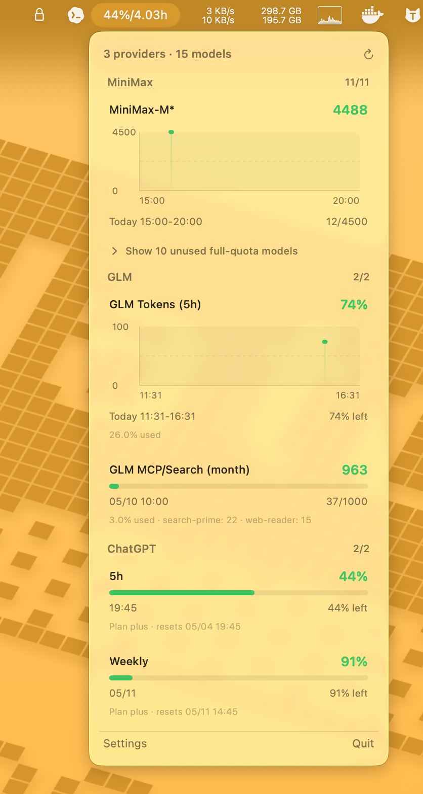
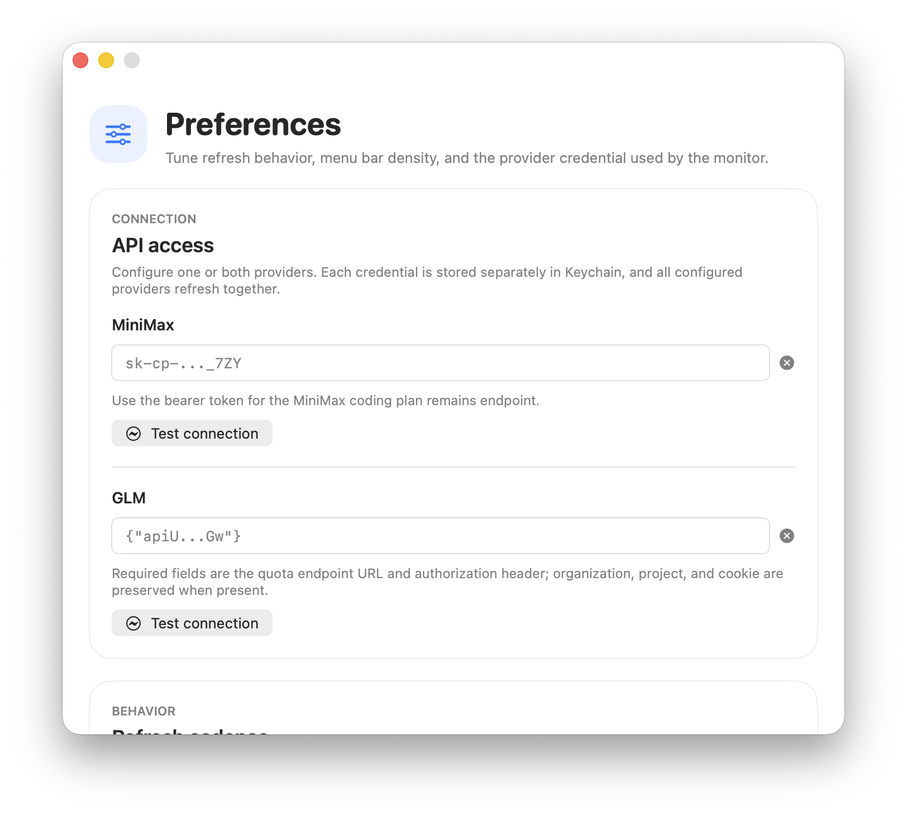

# AI Quota Bar

A macOS menu bar application for monitoring model coding plan quota across providers.

AI Quota Bar is focused on coding-plan consumption: it tracks the remaining quota for supported AI coding models, shows per-model breakdowns, and warns you before a short-interval or subscription quota runs out. It currently supports MiniMax, GLM/Z.ai, and ChatGPT/Codex GPT coding quota snapshots.

## Features

- Menu bar widget displaying remaining coding-plan quota
- Detailed per-provider and per-model usage breakdown
- Quota trend charts for short-interval model limits
- Configurable refresh interval
- Warning notifications when quota runs low
- Secure provider credential storage via Keychain

## Screenshots

<!-- Menu Bar -->


<!-- Dropdown Menu -->


<!-- Settings -->


## Requirements

- macOS 14+
- MiniMax API key, GLM quota curl command, ChatGPT/Codex session JSON or quota curl command, or any combination of them

## Build & Run

```bash
make build
make run
```

## License

This project is licensed under the MIT License - see [LICENSE](LICENSE) for details.

## Install

```bash
make install
```

## Configuration

1. Click the menu bar icon
2. Select **Settings**
3. Enter a MiniMax API key, paste a GLM quota curl command, paste a ChatGPT/Codex session JSON or quota curl command, or configure multiple providers
4. Configured providers refresh together and appear as separate sections in the menu
5. Adjust refresh interval as needed

## MiniMax support

For MiniMax, paste the bearer token used by the MiniMax coding plan remains endpoint. The app calls the MiniMax coding plan quota API and maps the returned model quota windows into the menu bar and dropdown views.

## GLM support

For GLM/Z.ai, the quota API is tied to your signed-in web session. You need to copy the request from the official website yourself:

1. Sign in to the official BigModel/Z.ai website in your browser.
2. Open the coding plan or quota page where your model quota is displayed.
3. Open the browser developer tools.
4. Refresh the quota page or trigger the quota query again.
5. In the Network panel, find the `quota/limit` request.
6. Copy that request as a curl command.
7. Paste the full curl command into AI Quota Bar Settings.

The app parses the endpoint URL, `authorization`, `bigmodel-organization`, `bigmodel-project`, and cookie fields, then stores the parsed credential in Keychain.

GLM quota fields are mapped differently from MiniMax:

- `currentValue` means used amount.
- `usage` means total amount.
- Remaining amount is calculated as `usage - currentValue`.
- `TOKENS_LIMIT` is shown as `GLM Tokens (5h)`.
- `TIME_LIMIT` is shown as `GLM MCP/Search (month)`.

Because the GLM credential comes from your browser session, it may expire. If GLM refresh fails after a while, repeat the steps above and paste a fresh curl command.

## ChatGPT/Codex GPT support

For ChatGPT/Codex GPT coding quota, the app reads ChatGPT web-session usage data and maps the Codex rate-limit windows into the menu:

- `primary_window` is shown as `5h`, with remaining quota displayed as a percentage and reset shown as a time.
- `secondary_window` is shown as `Weekly`, with remaining quota displayed as a percentage and reset shown as a date.
- Plan details such as Plus or Pro are shown when returned by the session/usage response.

The easiest setup path is to paste the ChatGPT account/session JSON that contains an `accessToken`; AI Quota Bar uses it with `https://chatgpt.com/backend-api/codex/usage`. You can also paste a copied curl command for the same endpoint from the browser Network panel.

The ChatGPT web API is not a public stable API, so response fields can change. AI Quota Bar stores provider credentials in one Keychain JSON item and uses a flexible parser that looks for common fields such as utilization percentage, remaining percentage, reset time, `primary_window`, and `secondary_window`.
